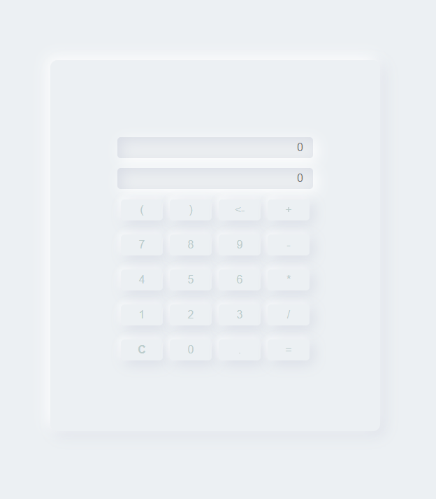

# Calculadora WEB

Uma calculadora simples utilizando uma combinação de HTML, CSS com design neomórfico e JavaScript. O design neomórfico proporciona uma estética moderna e agradável, enquanto o HTML fornece a estrutura básica, o CSS adiciona estilo e o JavaScript permite a funcionalidade interativa. Essa calculadora oferece uma experiência intuitiva e amigável para realizar cálculos de forma eficiente.

